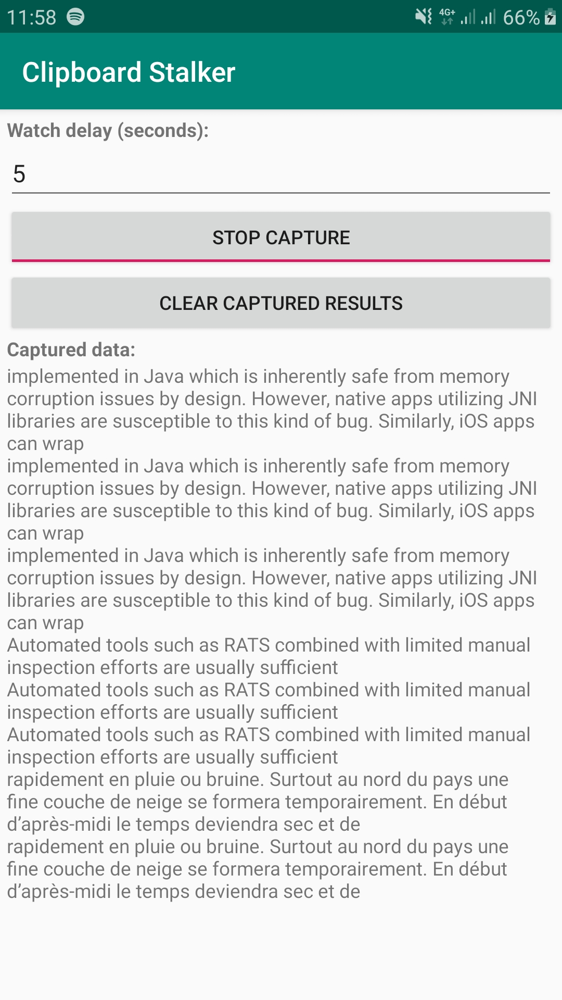

# Clipboard Stalker

Android v6+ application to monitor (stalk) the clipboard and grab the content (only text content is supported).

The application is developed using Android Studio so you can import the project into it in order to compile a APK bundle.

# Motivation

Show during a mobile application assessment, in a explicit way to non-technical people, than any application on the device can access to the clipboard content so that any sensitive data stored into it can be accessed.

Application like this exists on the Play store but I want to be sure that the content captured was not send anywhere and I have not found an Open source application published on the stored so I have decided to create and share a simple one.

# Build command line

Use the following command line to build a APK in debug mode `gradlew clean cleanBuildCache assembleDebug`

# Overview

